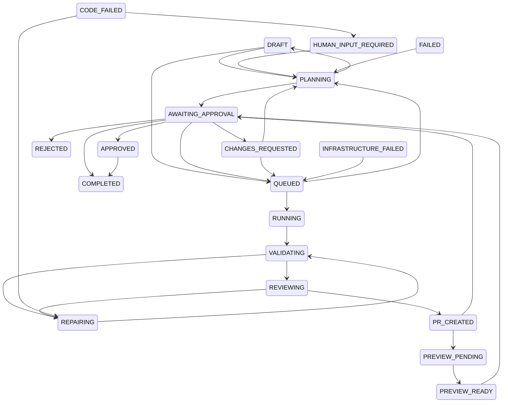

# Task State Machine

Status: active since P5. Package: `packages/state-machine` (`@foundry/state-machine`).
Database: enum `TaskState`, columns `Task.state` / `Task.currentAttemptId` /
`Task.updatedAt`, tables `TaskAttempt` and `TaskStateTransition`
(migration `20260808150000_task_state_machine`).

Deterministic code owns task state. AI agents propose work; only
`transitionTask()` advances the workflow, and only along the explicit
transition table below. No service may write `Task.state` directly.

## States (21)

| Group | States |
|---|---|
| Intake | `DRAFT`, `QUEUED`, `PLANNING` |
| Build | `RUNNING`, `VALIDATING`, `REVIEWING`, `REPAIRING` |
| Delivery | `PR_CREATED`, `PREVIEW_PENDING`, `PREVIEW_READY` |
| Human gates | `AWAITING_APPROVAL`, `CHANGES_REQUESTED`, `HUMAN_INPUT_REQUIRED`, `APPROVED` |
| Terminal | `REJECTED`, `SECURITY_BLOCKED`, `CANCELLED`, `COMPLETED` |
| Failure (recoverable) | `INFRASTRUCTURE_FAILED`, `CODE_FAILED`, `FAILED` |

Terminal states have no outgoing edges: `REJECTED`, `SECURITY_BLOCKED`,
`CANCELLED`, `COMPLETED`. (`FAILED` is deliberately not terminal — a human
may re-plan a failed task: `FAILED → PLANNING`.)

## Transition table

The machine (`src/transitions.ts`) encodes the specification's required
transitions plus the operational edges the existing control points already
perform. A transition not listed here does not exist.

| From | May move to |
|---|---|
| `DRAFT` | `PLANNING`, `QUEUED`, `CANCELLED` |
| `QUEUED` | `PLANNING`, `RUNNING`, `AWAITING_APPROVAL`, `FAILED`, `INFRASTRUCTURE_FAILED`, `CANCELLED` |
| `PLANNING` | `AWAITING_APPROVAL`, `RUNNING`, `DRAFT`, `FAILED`, `INFRASTRUCTURE_FAILED`, `CANCELLED` |
| `RUNNING` | `VALIDATING`, `SECURITY_BLOCKED`, `CODE_FAILED`, `INFRASTRUCTURE_FAILED`, `FAILED`, `CANCELLED` |
| `VALIDATING` | `REVIEWING`, `REPAIRING`, `SECURITY_BLOCKED`, `CODE_FAILED`, `INFRASTRUCTURE_FAILED`, `FAILED`, `CANCELLED` |
| `REPAIRING` | `VALIDATING`, `HUMAN_INPUT_REQUIRED`, `SECURITY_BLOCKED`, `CODE_FAILED`, `FAILED`, `CANCELLED` |
| `REVIEWING` | `PR_CREATED`, `REPAIRING`, `SECURITY_BLOCKED`, `FAILED`, `CANCELLED` |
| `PR_CREATED` | `PREVIEW_PENDING`, `AWAITING_APPROVAL`, `FAILED`, `CANCELLED` |
| `PREVIEW_PENDING` | `PREVIEW_READY`, `AWAITING_APPROVAL`, `INFRASTRUCTURE_FAILED`, `CANCELLED` |
| `PREVIEW_READY` | `AWAITING_APPROVAL`, `CANCELLED` |
| `AWAITING_APPROVAL` | `QUEUED`, `APPROVED`, `REJECTED`, `CHANGES_REQUESTED`, `COMPLETED`, `CANCELLED` |
| `CHANGES_REQUESTED` | `QUEUED`, `PLANNING`, `REJECTED`, `CANCELLED` |
| `HUMAN_INPUT_REQUIRED` | `PLANNING`, `QUEUED`, `REJECTED`, `CANCELLED` |
| `APPROVED` | `COMPLETED` |
| `INFRASTRUCTURE_FAILED` | `QUEUED`, `FAILED`, `CANCELLED` |
| `CODE_FAILED` | `REPAIRING`, `HUMAN_INPUT_REQUIRED`, `FAILED`, `CANCELLED` |
| `FAILED` | `PLANNING`, `CANCELLED` |
| `REJECTED`, `SECURITY_BLOCKED`, `CANCELLED`, `COMPLETED` | — (terminal) |

Spec-required edges verified by unit test (§spec): `DRAFT→QUEUED`,
`QUEUED→PLANNING`, `PLANNING→AWAITING_APPROVAL`,
`AWAITING_APPROVAL→RUNNING`, `RUNNING→VALIDATING`,
`VALIDATING→REVIEWING`, `REVIEWING→PR_CREATED`, `PR_CREATED→PREVIEW_PENDING`,
`PREVIEW_PENDING→PREVIEW_READY`, `PREVIEW_READY→AWAITING_APPROVAL`,
`AWAITING_APPROVAL→APPROVED`, `APPROVED→COMPLETED`, plus rejection and
failure edges.

(Failure/cancel edges into `FAILED`, `INFRASTRUCTURE_FAILED`, `CODE_FAILED`,
`SECURITY_BLOCKED`, `CANCELLED` omitted from the diagram for readability —
the table is authoritative.)

## Write path: `transitionTask(db, input)`

`db` may be a `PrismaClient` or an interactive Prisma transaction — the
package depends only on a small structural interface (`TransitionDbClient`),
never on generated Prisma types.

Guarantees:

1. **Validation** — target must be reachable from the current state per the
   table. Otherwise `InvalidTaskTransitionError` is thrown and an
   `AuditEvent` (`task.transition_rejected`) is recorded.
2. **Atomicity with optimistic concurrency** — the state move is a single
   conditional `UPDATE ... WHERE id = ? AND state = <expected>` (optionally
   `AND currentAttemptId = <attempt>` when `expectCurrentAttemptId` is
   given). If it affects anything but exactly one row, a
   `TaskTransitionConflictError` is thrown and
   `task.transition_conflict` is audited. Two workers or a worker racing a
   human can never double-advance a task.
3. **Immutable audit** — every accepted move inserts a `TaskStateTransition`
   row (from/to/actor/actorType/reason/attemptId/correlationId/metadata,
   server timestamp), plus a `task.state_changed` `AuditEvent` for the
   existing activity feed.
4. **Legacy dual-write** — the same atomic `UPDATE` also writes the legacy
   `Task.status` string (default from `LEGACY_STATUS_BY_STATE`, overridable
   via `legacyStatus`), so the existing dashboard remains consistent while
   it is migrated to `state` in later phases.
5. **Field folding** — `extraTaskData` (e.g. `startedAt`, `pullRequestUrl`,
   `tokenUsage: { increment }`) folds into the same conditional `UPDATE`;
   there is no separate unguarded write.

Duplicate delivery (queue retry of an already-processed transition) degrades
to a conflict or rejection: audited, never silently re-applied.

## Attempts: `TaskAttempt` + `Task.currentAttemptId`

Each execution start creates a `TaskAttempt` row
(`@@unique([taskId, attemptNumber])`) in the same transaction that sets
`Task.currentAttemptId`. All worker-driven transitions from that execution
carry `expectCurrentAttemptId`: a stale worker whose attempt has been
superseded can no longer move the task at all — the conditional write
misses, the conflict is audited, and its writes roll back.

Attempts record `correlationId` (queue job id), `workspacePath`,
`branchName`, `commitSha`, `outcomeSummary`, `startedAt`/`endedAt`, and a
`status` of `running | succeeded | failed`.

`TaskStateTransition.attemptId` has an `ON DELETE SET NULL` foreign key:
deleting an attempt never deletes transition history.

## Legacy status mapping

The legacy `Task.status` column is retained during the transition period
and written on every transition (dual-write). One mapping is deliberately
lossy: both `awaiting_plan_approval` and `awaiting_human_review` collapse to
`AWAITING_APPROVAL`, because the machine tracks *position in the workflow*
while `Approval` rows (`approvalType: 'plan' | 'merge'`) carry *which* gate
is open. Call sites that care pass the exact legacy string to write.

| Legacy `status` | Backfilled `state` | Notes |
|---|---|---|
| `draft` | `DRAFT` | |
| `queued` | `QUEUED` | |
| `approved` | `QUEUED` | legacy "approved plan, ready to execute" |
| `planning` | `PLANNING` | |
| `coding` | `RUNNING` | |
| `testing` | `VALIDATING` | |
| `reviewing` | `REVIEWING` | |
| `awaiting_plan_approval` | `AWAITING_APPROVAL` | plan gate (lossy, see above) |
| `awaiting_human_review` | `AWAITING_APPROVAL` | merge gate (lossy, see above) |
| `pull_request_open` | `PR_CREATED` | |
| `preview_ready` | `PREVIEW_READY` | |
| `approved_for_merge` | `APPROVED` | |
| `rejected` | `REJECTED` | |
| `failed` | `FAILED` | |
| `cancelled` | `CANCELLED` | |
| `completed` | `COMPLETED` | |

The migration's backfill `UPDATE` applies exactly this table (verified
16/16 against a database seeded with one task per legacy status).

## Current drivers

| Driver | Transitions it performs |
|---|---|
| Dashboard `PATCH /api/tasks/[id]` (`request_plan`) | `DRAFT/FAILED → PLANNING` |
| Dashboard plan approval | `AWAITING_APPROVAL → QUEUED` (or `→ COMPLETED` for manager evaluations) |
| Dashboard plan rejection | `AWAITING_APPROVAL → REJECTED` |
| Dashboard final approval | `AWAITING_APPROVAL → APPROVED` |
| Dashboard final rejection | `AWAITING_APPROVAL → REJECTED` |
| Dashboard queue-outage rollbacks | `PLANNING → DRAFT|FAILED`, `QUEUED → AWAITING_APPROVAL` |
| Dashboard merge checker | `APPROVED → COMPLETED` |
| Dashboard project authorization (manager evaluation) | create + `DRAFT → PLANNING`, enqueue failure `PLANNING → FAILED` |
| Orchestrator (planning worker) | `PLANNING → AWAITING_APPROVAL`, `PLANNING → FAILED` |
| Runner (execution worker) | `QUEUED/AWAITING_APPROVAL → RUNNING → VALIDATING → REVIEWING → AWAITING_APPROVAL`; failure `* → FAILED` (conflict-tolerant) |

Reserved for later phases (edges already exist, drivers arrive with their
phase): `REPAIRING` (P11 repair loop), `CHANGES_REQUESTED` +
`HUMAN_INPUT_REQUIRED` (P11/P12 review feedback), `PR_CREATED` /
`PREVIEW_PENDING` / `PREVIEW_READY` (P13 delivery), `SECURITY_BLOCKED`
(P10/P16 validation engine), `INFRASTRUCTURE_FAILED` vs `CODE_FAILED`
split (P7/P11), `CANCELLED` (P14 emergency stop).

## Tests

Unit — `npm test --workspace=packages/state-machine` (16 tests):
exact 21-state set and order; table completeness and reachability; every
spec example transition present; identity/skip moves invalid; operational
edges; legacy map round-trip incl. the documented lossy point; valid move
atomic + audited; invalid move rejected + audited; lost-race conflict
audited; missing task; attempt-scoped guard; extraTaskData folding;
unrecognized stored state cannot be laundered.

Database — PGlite harness (16 checks, run in the P5 phase; re-runnable):
migration applies over baseline+P4 with data present; fresh empty install;
parity block (incl. `TaskState` labels/order, column sets, indexes, six
CASCADE FKs + one SET NULL FK); exact 16/16 backfill mapping; legacy column
preserved; new-row defaults; conditional-UPDATE concurrency probe;
transition row shape; attempt uniqueness; SET NULL on attempt delete;
cascades; regression of P3/P4 invariants.

## Files

| Path | Role |
|---|---|
| `packages/state-machine/src/states.ts` | the 21 states, terminal set |
| `packages/state-machine/src/transitions.ts` | explicit transition table, reachability |
| `packages/state-machine/src/legacy-map.ts` | legacy status mapping (both directions) |
| `packages/state-machine/src/transition.ts` | the only write path |
| `packages/state-machine/src/errors.ts` | `TaskNotFoundError`, `InvalidTaskTransitionError`, `TaskTransitionConflictError` |
| `packages/database/prisma/migrations/20260808150000_task_state_machine/` | enum, columns, backfill, new tables |
| `scripts/verify-schema-parity.sql` | engine-independent parity assertions |
